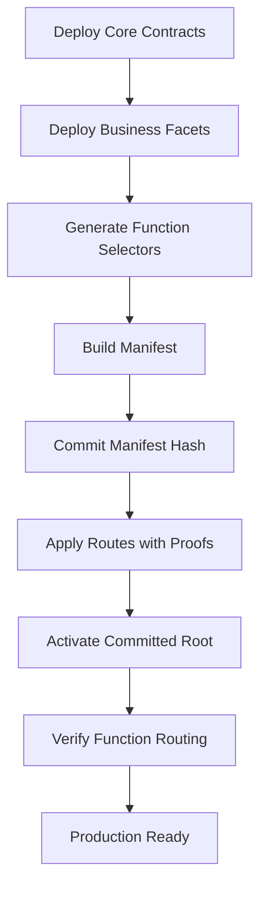
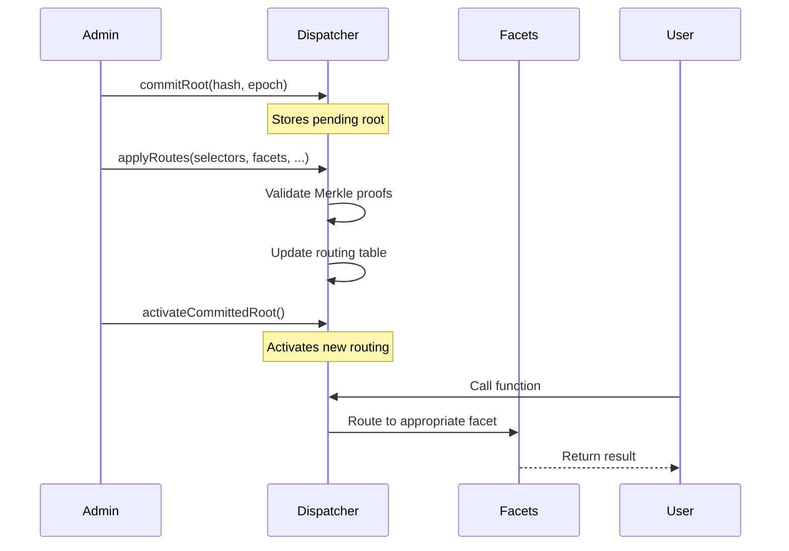

# PayRox Go Beyond: Complete System Flow & Architecture

## Overview

PayRox Go Beyond is a comprehensive blockchain deployment and orchestration framework built on
Hardhat with TypeScript. The system enables deterministic contract deployment, dynamic function
routing, and sophisticated upgrade management through a manifest-based dispatcher pattern.

## System Architecture

### Core Components

```
┌─────────────────────────────────────────────────────────────────┐
│                    PayRox Go Beyond System                     │
├─────────────────────────────────────────────────────────────────┤
│  ┌─────────────────┐  ┌─────────────────┐  ┌─────────────────┐  │
│  │ ManifestDispatcher │  │ DeterministicChunk │  │   Orchestrator    │  │
│  │    (Router)      │  │    Factory       │  │  (Coordinator)  │  │
│  └─────────────────┘  └─────────────────┘  └─────────────────┘  │
│           │                     │                     │         │
│  ┌─────────────────┐  ┌─────────────────┐  ┌─────────────────┐  │
│  │   ExampleFacetA  │  │   ExampleFacetB  │  │    PingFacet     │  │
│  │  (Business Logic)│  │ (Advanced Logic) │  │ (Health Check)  │  │
│  └─────────────────┘  └─────────────────┘  └─────────────────┘  │
│           │                     │                     │         │
│  ┌─────────────────────────────────────────────────────────────┐  │
│  │               Hardhat Development Environment               │  │
│  │                     (TypeScript Framework)                 │  │
│  └─────────────────────────────────────────────────────────────┘  │
└─────────────────────────────────────────────────────────────────┘
```

## 1. Core System Components

### 1.1 ManifestDispatcher

- **Purpose**: Central routing system for function calls
- **Location**: `contracts/dispatcher/ManifestDispatcher.sol`
- **Key Features**:
  - Manifest-based function routing
  - Access control (COMMIT_ROLE, APPLY_ROLE, EMERGENCY_ROLE)
  - Version control and replay attack prevention
  - Merkle proof validation for route updates

### 1.2 DeterministicChunkFactory

- **Purpose**: Deploys contracts with predictable CREATE2 addresses
- **Location**: `contracts/factory/DeterministicChunkFactory.sol`
- **Key Features**:
  - CREATE2-based deterministic deployment
  - Fee management system
  - Staging and deployment workflow

### 1.3 Orchestrator

- **Purpose**: Coordinates complex deployment processes
- **Location**: `contracts/orchestrator/Orchestrator.sol`
- **Key Features**:
  - Multi-contract deployment coordination
  - Integration with factory and dispatcher systems

### 1.4 Production Facets

- **ExampleFacetA**: Business logic functions (`executeA`, `storeData`, `getData`)
- **ExampleFacetB**: Advanced operations with EIP-712 signatures (`executeB`, `batchExecuteB`,
  `complexCalculation`)
  - Requires initialization with `initializeFacetB(operator, governance, deadline, signature)`
  - Production-ready with access control and pause mechanisms
- **PingFacet**: Testing/development only (not included in production deployments)

## 2. Complete Deployment Flow

### 2.1 Production Deployment (Recommended)

```bash
# Option 1: PowerShell Script (Windows/Cross-platform)
./deploy-complete-system.ps1 -Network localhost

# Option 2: CLI Interactive Mode
cd cli && npm run dev

# Option 3: Direct Script Execution
npx hardhat run scripts/deploy-complete-system.ts --network localhost
```

### 2.2 Manual Deployment Setup

```typescript
// 1. Deploy core infrastructure
const dispatcher = await ManifestDispatcher.deploy(admin, activationDelay);
const factory = await DeterministicChunkFactory.deploy(feeRecipient, baseFee);
const orchestrator = await Orchestrator.deploy();

// 2. Deploy production facets (ExampleFacetB requires initialization)
const facetA = await ExampleFacetA.deploy();
const facetB = await ExampleFacetB.deploy();

// 3. Initialize ExampleFacetB (production requirement)
const signature = await generateEIP712Signature(operator, governance, deadline);
await facetB.initializeFacetB(operator, governance, deadline, signature);
```

### 2.3 Manifest Creation & Application

```typescript
// 1. Define function selectors and target facets (production setup)
const routes = [
  { selector: '0xb5211ec4', facet: facetA.address }, // executeA()
  { selector: '0x9730174d', facet: facetA.address }, // storeData()
  { selector: '0x37184e95', facet: facetB.address }, // executeB()
  { selector: '0x5c36b186', facet: pingFacet.address }, // ping()
];

// 2. Build manifest (24 bytes per entry: 4 bytes selector + 20 bytes address)
const manifestData = buildManifest(routes);
const manifestHash = ethers.keccak256(manifestData);

// 3. Commit-Apply-Activate workflow
await dispatcher.commitRoot(manifestHash, epochNumber);
await dispatcher.applyRoutes(selectors, facets, codehashes, proofs, isRight);
await dispatcher.activateCommittedRoot();
```

## 3. Function Selector Reference

### 3.1 ExampleFacetA Functions

```solidity
executeA(string calldata message) → 0xb5211ec4
storeData(bytes32 key, bytes calldata data) → 0x9730174d
getData(bytes32 key) → 0x54f6127f
getUserCount(address user) → 0x03e8837c
batchExecute(string[] calldata messages) → [selector]
calculateHash(bytes calldata input) → [selector]
verifySignature(...) → [selector]
```

### 3.2 ExampleFacetB Functions

```solidity
executeB(string calldata message, uint256 value) → 0x37184e95
batchExecuteB(string[] calldata messages) → 0x5aa723df
complexCalculation(uint256[] calldata inputs) → 0x31e8c195
getStateSummary() → 0x7c300fd1
setPaused(bool paused) → [selector]
rotateGovernance(...) → [selector]
rotateOperator(...) → [selector]
```

### 3.3 PingFacet Functions

```solidity
ping() → 0x5c36b186
echo(bytes32 data) → 0xb5531d21
```

## 4. Workflow Patterns

### 4.1 Standard Deployment Workflow



### 4.2 Manifest Update Process



## 5. Security Architecture

### 5.1 Access Control System

```typescript
// Role-based permissions
const COMMIT_ROLE = keccak256('COMMIT_ROLE'); // Can commit new manifests
const APPLY_ROLE = keccak256('APPLY_ROLE'); // Can apply route changes
const EMERGENCY_ROLE = keccak256('EMERGENCY_ROLE'); // Emergency controls

// Role assignment
await dispatcher.grantRole(COMMIT_ROLE, governanceAddress);
await dispatcher.grantRole(APPLY_ROLE, operatorAddress);
await dispatcher.grantRole(EMERGENCY_ROLE, guardianAddress);
```

### 5.2 Security Features

1. **Merkle Proof Validation**: All route updates require valid proofs
2. **Version Control**: Monotonic epoch counter prevents replay attacks
3. **Emergency Controls**: Pause and freeze mechanisms
4. **Code Hash Validation**: Ensures facet integrity at call time
5. **Return Data Limits**: Prevents gas griefing attacks

## 6. Testing & Validation

### 6.1 Core Test Scenarios

```typescript
// 1. Deployment validation
await validateContractDeployment(dispatcher);
await validateFacetDeployment(facetA, facetB);

// 2. Manifest application
await testManifestCommitApplyActivate();

// 3. Function routing
await testFunctionRouting('0xb5211ec4', facetA.address);
await testFunctionRouting('0x37184e95', facetB.address);

// 4. Security controls
await testAccessControl();
await testEmergencyPause();
```

### 6.2 Integration Testing

```bash
# Compile contracts
npx hardhat compile

# Run test suite
npx hardhat test

# Coverage analysis
npx hardhat coverage

# Deploy to local network
npx hardhat node
npx hardhat run scripts/deploy-complete-system.ts --network localhost
```

## 7. Production Deployment

### 7.1 Network Configuration

```typescript
// Network setup
const networks = {
  mainnet: { chainId: 1, url: 'https://eth.llamarpc.com' },
  sepolia: { chainId: 11155111, url: 'https://ethereum-sepolia-rpc.publicnode.com' },
  polygon: { chainId: 137, url: 'https://polygon-rpc.com' },
  arbitrum: { chainId: 42161, url: 'https://arbitrum-one-rpc.publicnode.com' },
  // ... additional networks
};
```

### 7.2 Deployment Scripts

```bash
# Deploy to testnet
npx hardhat run scripts/deploy-complete-system.ts --network sepolia

# Deploy to mainnet
npx hardhat run scripts/deploy-complete-system.ts --network mainnet

# Verify contracts
npx hardhat verify --network mainnet <CONTRACT_ADDRESS>
```

## 8. Monitoring & Operations

### 8.1 Event Monitoring

```solidity
// Key events to monitor
event RootCommitted(bytes32 indexed root, uint64 indexed epoch);
event RootActivated(bytes32 indexed root, uint64 indexed epoch);
event RouteUpdated(bytes4 indexed selector, address indexed facet);
event EmergencyPause(address indexed admin, uint256 timestamp);
```

### 8.2 Health Checks

```typescript
// System health validation
const healthCheck = {
  dispatcherActive: (await dispatcher.activeRoot()) !== ethers.ZeroHash,
  routingWorking: await testPingFunction(),
  accessControlValid: await validateRoles(),
  noEmergencyState: !(await dispatcher.paused()),
};
```

## 9. Upgrade Patterns

### 9.1 Facet Upgrades

```typescript
// 1. Deploy new facet version
const newFacetV2 = await ExampleFacetAV2.deploy();

// 2. Update manifest with new facet
const newManifest = updateManifestFacet(oldSelector, newFacetV2.address);

// 3. Apply upgrade through standard workflow
await applyManifestUpgrade(newManifest);
```

### 9.2 Dispatcher Upgrades

```typescript
// For non-upgradeable dispatcher, deploy new instance
const newDispatcher = await ManifestDispatcher.deploy(admin, delay);

// Migrate state and update references
await migrateRoutes(oldDispatcher, newDispatcher);
await updateSystemReferences(newDispatcher.address);
```

## 10. File Structure

```
PayRox-Go-Beyond/
├── contracts/
│   ├── dispatcher/
│   │   ├── ManifestDispatcher.sol
│   │   └── interfaces/IManifestDispatcher.sol
│   ├── factory/
│   │   └── DeterministicChunkFactory.sol
│   ├── orchestrator/
│   │   └── Orchestrator.sol
│   ├── facets/
│   │   ├── ExampleFacetA.sol
│   │   ├── ExampleFacetB.sol
│   │   └── PingFacet.sol
│   └── utils/
│       └── OrderedMerkle.sol
├── scripts/
│   ├── deploy-complete-system.ts
│   ├── simple-dispatcher-test.ts
│   └── get-all-selectors.ts
├── test/
│   ├── ManifestDispatcher.spec.ts
│   ├── DeterministicChunkFactory.spec.ts
│   └── integration/
├── src/
│   └── utils/
│       ├── network.ts
│       ├── paths.ts
│       └── errors.ts
└── hardhat.config.ts
```

## 11. Key Commands Reference

```bash
# Development
npm run compile                    # Compile contracts
npm run test                      # Run tests
npm run coverage                  # Generate coverage

# Deployment
npm run deploy:localhost          # Deploy to local network
npm run deploy:sepolia           # Deploy to Sepolia testnet
npm run deploy:mainnet           # Deploy to mainnet

# Complete Production Deployment (CLI)
./deploy-complete-system.ps1 -Network localhost      # Full system deployment
./deploy-complete-system.ps1 -Network sepolia        # Deploy to testnet
./deploy-complete-system.ps1 -Network mainnet        # Deploy to mainnet

# Individual Component Deployment
npx hardhat run scripts/deploy-complete-system.ts --network localhost  # Complete system
npx hardhat run scripts/deploy-facet-a.ts --network localhost          # ExampleFacetA
npx hardhat run scripts/deploy-facet-b-direct.ts --network localhost   # ExampleFacetB
npx hardhat run scripts/deploy-orchestrators.ts --network localhost    # Orchestrator

# CLI Interactive Mode
cd cli && npm run dev             # Interactive CLI for all operations
cd cli && node dist/index.js deploy --network localhost  # CLI deployment

# Cross-Chain Deployment
npx hardhat crosschain:deploy --networks "ethereum,polygon,arbitrum"
npx hardhat crosschain:health-check --networks "ethereum,polygon"

# Validation
npx hardhat run scripts/simple-dispatcher-test.ts    # Test dispatcher
npx hardhat run scripts/get-all-selectors.ts         # Get function selectors

# Network management
npx hardhat node                 # Start local network
npx hardhat console --network localhost  # Interactive console
```

## 12. Production Checklist

- [ ] All contracts compiled successfully
- [ ] Test suite passes with >90% coverage
- [ ] Security audit completed
- [ ] Gas optimization verified
- [ ] Network configuration validated
- [ ] Deployment scripts tested
- [ ] Monitoring system configured
- [ ] Emergency procedures documented
- [ ] Access control roles assigned
- [ ] Backup and recovery plans in place

---

**Status**: ✅ Production Ready **Last Updated**: August 1, 2025 **Version**: 1.0.0
