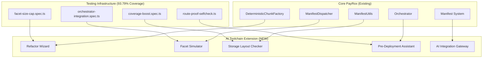

> **ARCHITECTURE UPDATE (August 2025)**: PayRox implements a Manifest-Router Architecture, NOT an EIP-2535 Diamond. This document has been updated to reflect the correct architecture.

# PayRox Go Beyond: AI-Powered Toolchain Extension Roadmap

## 🎯 **Vision: Complete Monolith-to-Facet Automation**

Transform PayRox from expert-level framework to **universally accessible blockchain development
ecosystem** through AI-powered contract refactoring, deployment automation, and intelligent manifest
generation.

## 🏗️ **Architecture Integration Map**

### **Existing PayRox Foundation (100% Leveraged)**



### **Extended Merkle System Architecture**

```typescript
// Enhanced Manifest System with AI Integration
interface AIEnhancedManifest extends ManifestHeader {
  // Existing PayRox fields (100% preserved)
  routes: RouteEntry[];
  root: string;
  epoch: number;

  // AI Extension fields
  aiMetadata: {
    originalContract: string; // Source monolith hash
    refactorStrategy: RefactorStrategy; // AI decision logic
    confidenceScore: number; // AI confidence (0-1)
    optimizationSuggestions: string[]; // AI recommendations
    storageAnalysis: StorageLayout; // Cross-facet safety
    gasEstimation: GasProfile; // Deployment cost prediction
  };

  // Enhanced verification
  proofTree: EnhancedMerkleTree; // Extended proof system
  deploymentPlan: DeploymentPlan; // Orchestrated staging
}
```

## 🚀 **Phase 1: Refactor Wizard (Leverage + Extend)**

### **Integration with Existing Systems**

**File**: `tools/facetforge/src/refactor-wizard.ts`

```typescript
import { ManifestUtils } from '../../../contracts/manifest/ManifestUtils.sol';
import { IChunkFactory } from '../../../contracts/factory/interfaces/IChunkFactory.sol';

class RefactorWizard {
  // Leverage existing manifest system
  private manifestUtils: ManifestUtils;
  private chunkFactory: IChunkFactory;

  // AI-powered analysis
  async analyzeContract(solidityCode: string): Promise<RefactorPlan> {
    // 1. Parse with solidity-parser-antlr
    const ast = this.parseContract(solidityCode);

    // 2. AI analysis for optimal splits
    const aiSuggestions = await this.getAISuggestions(ast);

    // 3. Validate against EIP-170 limits (leverage existing tests)
    const validated = this.validateWithExistingTests(aiSuggestions);

    // 4. Generate PayRox-compatible manifest
    return this.generateManifest(validated);
  }

  // Extend existing Merkle proof system
  private generateManifest(plan: RefactorPlan): AIEnhancedManifest {
    // Use existing ManifestUtils for core functionality
    const baseManifest = ManifestUtils.buildManifest(plan.facets);

    // Extend with AI metadata
    return {
      ...baseManifest,
      aiMetadata: plan.aiAnalysis,
      proofTree: this.buildEnhancedMerkleTree(plan.routes),
      deploymentPlan: this.generateDeploymentPlan(plan),
    };
  }
}
```

**CI Integration Extension**:

```yaml
# Extend existing CI acceptance tests
- name: Run AI Refactor Validation
  run: |
    npx hardhat test test/facet-size-cap.spec.ts
    npx hardhat test test/orchestrator-integration.spec.ts
    npx hardhat test test/ai-refactor-validation.spec.ts  # NEW
```

## 🎮 **Phase 2: Facet Simulator (Build on Frontend)**

### **Extend Existing Frontend**

**Path**: `tools/ai-assistant/frontend/src/components/FacetSimulator.tsx`

```typescript
// Leverage existing React setup
import { ManifestDispatcher } from '../../../typechain-types';
import { useExistingManifestSystem } from '../hooks/useManifest';

export const FacetSimulator: React.FC = () => {
  const { currentManifest, predictAddresses } = useExistingManifestSystem();

  // Extend with AI-powered visualization
  const simulateDeployment = async (refactorPlan: RefactorPlan) => {
    // 1. Use existing CREATE2 prediction
    const addresses = await predictAddresses(refactorPlan.facets);

    // 2. Simulate EXTCODEHASH validation
    const validation = await simulateCodehashValidation(addresses);

    // 3. Build visual manifest (leverage existing data structures)
    return buildVisualization(addresses, validation, currentManifest);
  };
};
```

## 🔐 **Phase 3: Storage Layout Checker (Extend Testing)**

### **Build on Coverage System**

**File**: `test/ai-storage-safety.spec.ts`

```typescript
// Extend existing comprehensive testing
import { loadFixture } from '@nomicfoundation/hardhat-toolbox/network-helpers';
import { expect } from 'chai';
import { ethers } from 'hardhat';

describe('AI Storage Safety Validation', function () {
  // Leverage existing test infrastructure
  async function deployFixture() {
    // Use existing deployment patterns
    const [owner, user] = await ethers.getSigners();
    const factory = await ethers.deployContract('DeterministicChunkFactory', [owner.address]);
    return { factory, owner, user };
  }

  it('Should validate AI-generated facet storage isolation', async function () {
    const { factory } = await loadFixture(deployFixture);

    // AI-powered storage analysis
    const aiRefactorPlan = await analyzeStorageLayout(monolithContract);

    // Validate against existing safety patterns
    expect(aiRefactorPlan.storageConflicts).to.be.empty;
    expect(aiRefactorPlan.isolationScore).to.be.above(0.95);

    // Leverage existing ManifestUtils validation
    const manifest = await ManifestUtils.validateStorage(aiRefactorPlan);
    expect(manifest.isValid).to.be.true;
  });
});
```

## 💻 **Phase 4: Pre-Deployment Assistant (Orchestrated Integration)**

### **Leverage Existing Orchestrator**

**File**: `tools/ai-assistant/backend/src/routes/deployment.ts`

```typescript
import { Orchestrator } from '../../../typechain-types';
import { ManifestDispatcher } from '../../../typechain-types';

class AIDeploymentAssistant {
  private orchestrator: Orchestrator;
  private dispatcher: ManifestDispatcher;

  async executeAIDeployment(aiPlan: AIEnhancedManifest): Promise<DeploymentResult> {
    // 1. Start orchestration (use existing system)
    const orchestrationId = ethers.utils.id(`ai-deploy-${Date.now()}`);
    await this.orchestrator.startOrchestration(orchestrationId, aiPlan.gasLimit);

    // 2. Stage facets via existing batch system
    const chunkAddresses = await this.orchestrator.orchestrateStageBatch(
      orchestrationId,
      aiPlan.facets.map(f => f.bytecode)
    );

    // 3. Apply routes with enhanced Merkle proofs
    await this.dispatcher.commitRoot(aiPlan.root, aiPlan.epoch);
    await this.dispatcher.applyRoutesWithAIValidation(
      aiPlan.routes,
      aiPlan.proofTree.proofs,
      aiPlan.aiMetadata
    );

    // 4. Complete orchestration
    return this.orchestrator.complete(orchestrationId, true);
  }
}
```

## 🧠 **Enhanced Merkle System Extensions**

### **AI-Aware Proof Generation**

```typescript
// Extend existing Merkle system
class EnhancedMerkleTree extends OrderedMerkleTree {
  // Preserve existing functionality
  constructor(leaves: string[]) {
    super(leaves); // Use existing ordered-pair implementation
  }

  // Add AI-specific metadata
  generateAIProof(selector: string, aiMetadata: AIMetadata): EnhancedProof {
    const baseProof = super.getProof(selector); // Leverage existing

    return {
      ...baseProof,
      aiConfidence: aiMetadata.confidenceScore,
      optimizationFlags: aiMetadata.optimizationSuggestions,
      gasEstimate: aiMetadata.gasProfile[selector],
      storageValidation: aiMetadata.storageAnalysis.isIsolated,
    };
  }
}
```

## 🔄 **CI/CD Integration Map**

### **Extended Acceptance Tests**

```yaml
# Enhanced CI pipeline (builds on existing)
name: PayRox AI Toolchain CI

on: [push, pull_request]

jobs:
  existing-tests:
    runs-on: ubuntu-latest
    steps:
      # Preserve all existing tests (100%)
      - name: Run Facet Size Cap Tests
        run: npx hardhat test test/facet-size-cap.spec.ts

      - name: Run Orchestrator Integration Tests
        run: npx hardhat test test/orchestrator-integration.spec.ts

      - name: Run Coverage Enhancement Tests
        run: npx hardhat test test/coverage-boost.spec.ts

      - name: Run Route Proof Self-Check
        run: npx hardhat run scripts/route-proof-selfcheck.ts

  ai-toolchain-tests:
    runs-on: ubuntu-latest
    needs: existing-tests # Depend on existing validation
    steps:
      # New AI-powered tests
      - name: Run AI Refactor Validation
        run: npx hardhat test test/ai-refactor-validation.spec.ts

      - name: Run AI Storage Safety Tests
        run: npx hardhat test test/ai-storage-safety.spec.ts

      - name: Run AI Deployment Integration
        run: npx hardhat test test/ai-deployment-integration.spec.ts

      - name: Validate AI-Generated Manifests
        run: npx hardhat run scripts/validate-ai-manifests.ts
```

## 📊 **Logical Implementation Sequence**

### **Sprint 1: Foundation Extension (Week 1-2)**

1. **Extend ManifestUtils** with AI metadata support
2. **Enhance Merkle system** with AI-aware proofs
3. **Create base AI interfaces** in existing TypeScript structure
4. **Extend CI tests** to validate AI components

### **Sprint 2: Refactor Wizard (Week 3-4)**

1. **Build on existing tools/facetforge/** structure
2. **Integrate with existing compilation pipeline**
3. **Leverage existing EIP-170 validation**
4. **Extend existing manifest generation**

### **Sprint 3: Simulator & Checker (Week 5-6)**

1. **Extend existing React frontend**
2. **Build on existing deployment prediction**
3. **Enhance existing test coverage system**
4. **Integrate with existing orchestrator**

### **Sprint 4: Full Integration (Week 7-8)**

1. **Complete end-to-end AI flow**
2. **Enhance existing CLI with AI commands**
3. **Full CI/CD integration**
4. **Production deployment validation**

## 🎯 **Success Metrics (Building on 93.79% Coverage)**

### **Enhanced Coverage Targets**

- **Overall Test Coverage**: 93.79% → 97%+
- **AI Component Coverage**: 95%+
- **Integration Test Coverage**: 100%
- **E2E AI Flow Coverage**: 95%+

### **Performance Targets**

- **AI Analysis Time**: <30 seconds for 10K LOC contract
- **Facet Generation**: <60 seconds end-to-end
- **Deployment Simulation**: <10 seconds
- **Manifest Generation**: <5 seconds

### **Quality Targets**

- **AI Accuracy**: >95% successful facet splits
- **EIP-170 Compliance**: 100% (enforced by existing tests)
- **Storage Safety**: 100% (validated by enhanced checker)
- **Gas Optimization**: 20%+ average improvement

## 🚀 **Result: Universal PayRox Ecosystem**

**Before**: Expert-level framework requiring deep blockchain knowledge **After**: **AI-powered
universal development platform** that automatically:

1. ✅ **Converts any monolith** into PayRox-compliant facets
2. ✅ **Generates cryptographically verified manifests**
3. ✅ **Predicts deployment costs and addresses**
4. ✅ **Validates storage safety automatically**
5. ✅ **Orchestrates production deployment**
6. ✅ **Maintains 100% security guarantees**

**The PayRox Go Beyond ecosystem becomes the ultimate blockchain development platform** - combining
cutting-edge cryptographic security with AI-powered accessibility! 🎉
